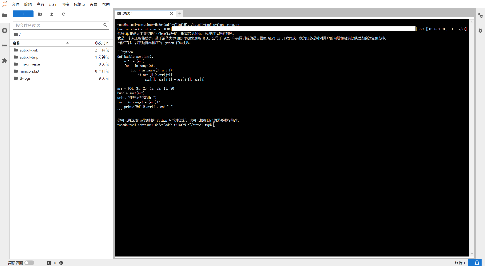

# ChatGLM3-6B Transformers部署调用

## 环境准备

在[autodl](https://www.autodl.com/)平台中租一个3090等24G显存的显卡机器，如下图所示镜像选择`PyTorch`-->`2.0.0`-->`3.8(ubuntu20.04)`-->`11.8`


接下来打开刚刚租用服务器的`JupyterLab`，并且打开其中的终端开始环境配置、模型下载和运行`demo`。

pip换源和安装依赖包

```shell
# 升级pip
python -m pip install --upgrade pip
# 更换 pypi 源加速库的安装
pip config set global.index-url https://pypi.tuna.tsinghua.edu.cn/simple

pip install modelscope
pip install transformers
```

## 模型下载

使用 `modelscope` 中的`snapshot_download`函数下载模型，第一个参数为模型名称，参数`cache_dir`为模型的下载路径。

在 `/root/autodl-tmp` 路径下新建 `download.py` 文件并在其中输入以下内容，粘贴代码后记得保存文件，如下图所示。并运行 `python /root/autodl-tmp/download.py`执行下载，模型大小为 14 GB，下载模型大概需要 10~20 分钟

```python
import torch
from modelscope import snapshot_download, AutoModel, AutoTokenizer
import os
model_dir = snapshot_download('ZhipuAI/chatglm3-6b', cache_dir='/root/autodl-tmp', revision='master')
```

## 代码准备

在/root/autodl-tmp路径下新建trans.py文件并在其中输入以下内容
```python
# 使用Hugging Face中'transformer'库中的AutoTokenizer和AutoModelForCausalLM以加载分词器和对话模型
from transformers import AutoTokenizer, AutoModelForCausalLM
import torch
# 使用模型下载到的本地路径以加载
model_dir = '/root/autodl-tmp/ZhipuAI/chatglm3-6b'
# 分词器的加载，本地加载，trust_remote_code=True设置允许从网络上下载模型权重和相关的代码
tokenizer = AutoTokenizer.from_pretrained(model_dir, trust_remote_code=True)
# 模型加载，本地加载，使用AutoModelForCausalLM类
model = AutoModelForCausalLM.from_pretrained(model_dir, trust_remote_code=True)
# 将模型移动到GPU上进行加速（如果有GPU的话）
device = torch.device("cuda" if torch.cuda.is_available() else "cpu")
model.to(device)
# 使用模型的评估模式来产生对话
model.eval()
# 第一轮对话
response, history = model.chat(tokenizer, "你好", history=[])
print(response)
# 第二轮对话
response, history = model.chat(tokenizer, "请介绍一下你自己", history=history)
print(response)
# 第三轮对话
response, history = model.chat(tokenizer, "请帮我使用python语言写一段冒泡排序的代码", history=history)
print(response)
```
### 部署

在终端输入以下命令运行trans.py，即实现ChatGLM3-6B的Transformers部署调用

```shell
cd /root/autodl-tmp
python trans.py
```
观察命令行中loading checkpoint表示模型正在加载，等待模型加载完成产生对话，如下图所示

