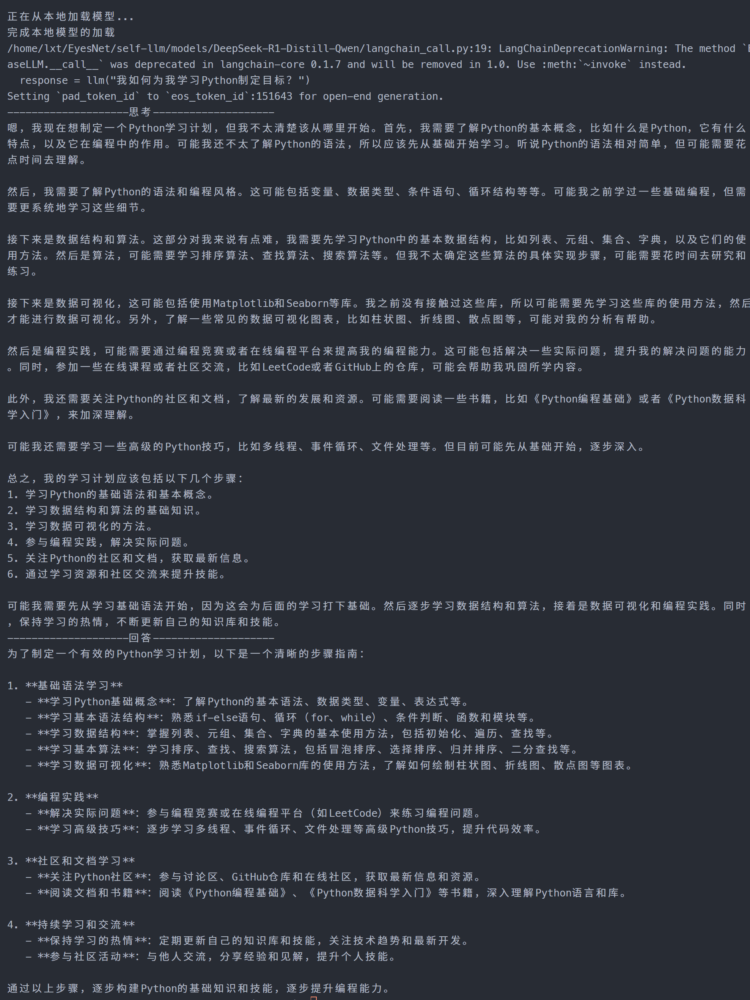

# DeepSeek-R1-Distill-Qwen-7B Langchain 接入

## 环境准备

本文基础环境如下：

```
----------------
ubuntu 22.04
python 3.12
cuda 12.1
pytorch 2.3.0
----------------
```

> 本文默认学习者已安装好以上 Pytorch(cuda) 环境，如未安装请自行安装。

pip 换源加速下载并安装依赖包

```shell
# 升级pip
python -m pip install --upgrade pip
# 更换 pypi 源加速库的安装
pip config set global.index-url https://pypi.tuna.tsinghua.edu.cn/simple

pip install transformers==4.48.2
pip install huggingface-hub==0.28.1
pip install accelerate==1.3.0
pip install modelscope==1.22.3
pip install langchain==0.3.17
```

> 考虑到部分同学配置环境可能会遇到一些问题，我们在 AutoDL 平台准备了 DeepSeek-R1-Distill-Qwe 的环境镜像，点击下方链接并直接创建 Autodl 示例即可。
> ***https://www.codewithgpu.com/i/datawhalechina/self-llm/DeepSeek-R1-Distill-Qwen***

## 模型下载

使用 `modelscope` 中的 `snapshot_download` 函数下载模型，第一个参数为模型名称，参数 `cache_dir` 为模型的下载路径。

在新建 `model_download.py` 文件并在其中输入以下内容，粘贴代码后记得保存文件，如下图所示。并运行 `python model_download.py` 执行下载。

```python
from modelscope import snapshot_download

model_dir = snapshot_download('deepseek-ai/DeepSeek-R1-Distill-Qwen-7B', cache_dir='/root/autodl-tmp', revision='master')
```

> 注意：记得修改 `cache_dir` 为你的模型下载路径哦~

## 代码准备

为便捷构建 `LLM` 应用，我们需要基于本地部署的 `DeepSeek_R1_Distill_Qwen_LLM`，自定义一个 `LLM` 类，将 `DeepSeek R1 Distill` 接入到 `LangChain` 框架中。完成自定义 `LLM` 类之后，可以以完全一致的方式调用 `LangChain` 的接口，而无需考虑底层模型调用的不一致。

基于本地部署的 `DeepSeek R1 Distill` 自定义 `LLM` 类并不复杂，我们只需从 `LangChain.llms.base.LLM` 类继承一个子类，并重写构造函数与 `_call` 函数即可：

在当前路径新建一个 `LLM.py` 文件，并输入以下内容，粘贴代码后记得保存文件。

```python
from langchain.llms.base import LLM
from typing import Any, List, Optional
from langchain.callbacks.manager import CallbackManagerForLLMRun
from transformers import AutoTokenizer, AutoModelForCausalLM, GenerationConfig
import torch

class DeepSeek_R1_Distill_Qwen_LLM(LLM):
    # 基于本地 DeepSeek_R1_Distill_Qwen 自定义 LLM 类
    tokenizer: AutoTokenizer = None
    model: AutoModelForCausalLM = None
      
    def __init__(self, mode_name_or_path :str):

        super().__init__()
        print("正在从本地加载模型...")
        self.tokenizer = AutoTokenizer.from_pretrained(mode_name_or_path, use_fast=False)
        self.model = AutoModelForCausalLM.from_pretrained(mode_name_or_path, torch_dtype=torch.bfloat16, device_map="auto")
        self.model.generation_config = GenerationConfig.from_pretrained(mode_name_or_path)
        print("完成本地模型的加载")
      
    def _call(self, prompt : str, stop: Optional[List[str]] = None,
                run_manager: Optional[CallbackManagerForLLMRun] = None,
                **kwargs: Any):

        messages = [{"role": "user", "content": prompt }]
        input_ids = self.tokenizer.apply_chat_template(messages, tokenize=False, add_generation_prompt=True)
        model_inputs = self.tokenizer([input_ids], return_tensors="pt").to('cuda')
        generated_ids = self.model.generate(model_inputs.input_ids, attention_mask=model_inputs['attention_mask'], max_new_tokens=8192) # 思考需要输出更多的Token数，设为8K
        generated_ids = [
            output_ids[len(input_ids):] for input_ids, output_ids in zip(model_inputs.input_ids, generated_ids)
        ]
        response = self.tokenizer.batch_decode(generated_ids, skip_special_tokens=True)[0]
      
        return response
    @property
    def _llm_type(self) -> str:
        return "DeepSeek_R1_Distill_Qwen_LLM"
```

在上述类定义中，我们分别重写了构造函数和 `_call` 函数：对于构造函数，我们在对象实例化的一开始加载本地部署的 `DeepSeek R1 Distill` 模型，从而避免每一次调用都需要重新加载模型带来的时间过长；`_call` 函数是 `LLM` 类的核心函数，`LangChain` 会调用该函数来调用 `LLM`，在该函数中，我们调用已实例化模型的 `generate` 方法，从而实现对模型的调用并返回调用结果。

在整体项目中，我们将上述代码封装为 `LLM.py`，后续将直接从该文件中引入自定义的 LLM 类。

## 调用

然后就可以像使用任何其他的langchain大模型功能一样使用了。

> 注意：记得修改模型路径为你的路径哦~

```python
from LLM import DeepSeek_R1_Distill_Qwen_LLM
import re

# 文本分割函数
def split_text(text):
    pattern = re.compile(r'<think>(.*?)</think>(.*)', re.DOTALL) # 定义正则表达式模式
    match = pattern.search(text) # 匹配 <think>思考过程</think>回答
  
    if match: # 如果匹配到思考过程
        think_content = match.group(1).strip() # 获取思考过程
        answer_content = match.group(2).strip() # 获取回答
    else:
        think_content = "" # 如果没有匹配到思考过程，则设置为空字符串
        answer_content = text.strip() # 直接返回回答
  
    return think_content, answer_content
  
llm = DeepSeek_R1_Distill_Qwen_LLM(mode_name_or_path = "/root/autodl-tmp/deepseek-ai/DeepSeek-R1-Distill-Qwen-7B")

response = llm("我如何为我学习Python制定目标？")
think, answer = split_text(response) # 调用split_text函数，分割思考过程和回答
print(f"{"-"*20}思考{"-"*20}")
print(think) # 输出思考
print(f"{"-"*20}回答{"-"*20}")
print(answer) # 输出回答
```


