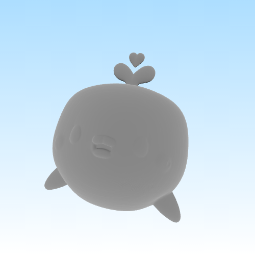
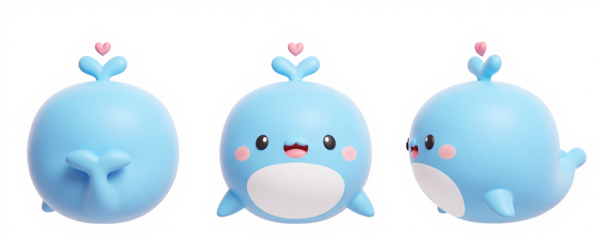

# Hunyuan3D-2系列模型代码调用

官方设计了一个类似diffusers的 API来供模型的加载执行，我们可以在项目仓库以及代码中修改，来指向我们模型存放的正确路径，默认加载路径为根目录下的缓存目录。

在项目仓库下：Hunyuan3D-2/hy3dgen/shapegen/utils.py:83

```python
    original_model_path = model_path
    # try local path
    base_dir = os.environ.get('HY3DGEN_MODELS', '~/autodl-tmp') # 这里指向为自己模型存放路径的上级目录
    model_path = os.path.expanduser(os.path.join(base_dir, model_path, subfolder))
    logger.info(f'Try to load model from local path: {model_path}')
```

# 单视图白模生成

让我们先来进行单视图基础白模生成模型Dit的代码调用，这里以调用hunyuan3d-dit-v2-0模型为例

在项目目录下新建代码文件，并在其中输入以下内容，粘贴代码后请及时保存文件

```python
import time

import torch
from PIL import Image

from hy3dgen.rembg import BackgroundRemover
from hy3dgen.shapegen import Hunyuan3DDiTFlowMatchingPipeline

image_path = 'assets/demo.png' # 这里修改为输入图像路径
image = Image.open(image_path).convert("RGBA")
if image.mode == 'RGB':
    rembg = BackgroundRemover()
    image = rembg(image)

pipeline = Hunyuan3DDiTFlowMatchingPipeline.from_pretrained(
    'weights/Hunyuan3D-2', # 这里修改为调用模型的本地路径
    subfolder='hunyuan3d-dit-v2-0',
    variant='fp16'
)

start_time = time.time()
mesh = pipeline(image=image,
                num_inference_steps=50,
                octree_resolution=380,
                num_chunks=20000,
                generator=torch.manual_seed(12345),
                output_type='trimesh'
                )[0]
print("--- %s seconds ---" % (time.time() - start_time))
mesh.export(f'demo.glb')
```

示例输入图像为我们可爱小鲸鱼的正面靓图：


hunyuan3d-dit-v2-0实测默认参数下生成白模输出为27s左右，显存占用约为7GB；hunyuan3d-dit-v2-mni输出为15s左右，显存占用约为4GB

输出的glb文件可以通过在线转换器或Blender进行阅览和使用，可以看到在单图生成下，小鲸鱼的尾巴似乎有点过于“板正”了哈哈



# 多视图白模生成

接下来我们以加载模型hunyuan3d-dit-v2-mv为例，输入多视图图像来进行基础白模生成模型Dit的代码调用

同样的，在项目目录下新建代码文件，修改对应路径，粘贴代码后请及时保存文件

```python
import time
import torch
from PIL import Image
from hy3dgen.rembg import BackgroundRemover
from hy3dgen.shapegen import Hunyuan3DDiTFlowMatchingPipeline

images = { # 这里修改为自己的多视图图像输入路径
    "front": "assets/front.png",
    "left": "assets/left.png",
    "back": "assets/back.png"
}

for key in images:
    image = Image.open(images[key]).convert("RGBA")
    if image.mode == 'RGB':
        rembg = BackgroundRemover()
        image = rembg(image)
    images[key] = image

pipeline = Hunyuan3DDiTFlowMatchingPipeline.from_pretrained(
    'weights/Hunyuan3D-2mv', # 这里修改为调用模型的本地路径
    subfolder='hunyuan3d-dit-v2-mv',
    variant='fp16'
)

start_time = time.time()
mesh = pipeline(
    image=images,
    num_inference_steps=50,
    octree_resolution=380,
    num_chunks=20000,
    generator=torch.manual_seed(12345),
    output_type='trimesh'
)[0]
print("--- %s seconds ---" % (time.time() - start_time))
mesh.export(f'demo_mv.glb')
```

示例输入图像为小鲸鱼的三视图：



hunyuan3d-dit-v2-mv实测默认参数下输出为36s左右，显存占用约为7GB

同样的，输出的glb文件可以通过在线转换器或Blender进行阅览和使用


通过多视图的输入，小鲸鱼的尾巴可以完整准确的表达出来

# 单视图的纹理合成

现在我们成功生成了基础白模，当然也少不了图像纹理的合成Paint

如果您使用的是指定本地数据盘路径存储模型文件，需要引用的Hunyuan3DPaintPipeline方法代码中去修改指向的路径规则，在项目仓库下：Hunyuan3D-2/hy3dgen/texgen/pipelines.py:55

```python
if not os.path.exists(model_path):
   # try local path
   base_dir = os.environ.get('HY3DGEN_MODELS', '~/autodl-tmp')  # 这里指向为自己模型存放路径的上级目录
   model_path = os.path.expanduser(os.path.join(base_dir, model_path))

   delight_model_path = os.path.join(model_path, 'hunyuan3d-delight-v2-0')
   multiview_model_path = os.path.join(model_path, 'hunyuan3d-paint-v2-0')
```

Paint需要在白模生成的基础上加载对应的Paint模型来实现，在本次示例中我们加载hunyuan3d-dit-v2-0来进行白模生成以及hunyuan3d-paint-v2-0进行纹理合成，具体代码如下：

```python
from PIL import Image

from hy3dgen.rembg import BackgroundRemover
from hy3dgen.shapegen import Hunyuan3DDiTFlowMatchingPipeline
from hy3dgen.texgen import Hunyuan3DPaintPipeline

model_path = 'weights/Hunyuan3D-2'# 这里修改为调用模型的本地路径
pipeline_shapegen = Hunyuan3DDiTFlowMatchingPipeline.from_pretrained(model_path)
pipeline_texgen = Hunyuan3DPaintPipeline.from_pretrained(model_path)

image_path = 'assets/demo.png'# 这里修改为自己图像的输入路径
image = Image.open(image_path).convert("RGBA")

if image.mode == 'RGB':
    rembg = BackgroundRemover()
    image = rembg(image)

mesh = pipeline_shapegen(image=image)[0]
mesh = pipeline_texgen(mesh, image=image)
mesh.export('demo_textured.glb')
```

加载hunyuan3d-paint-v2-0的纹理合成模型后，整体显存要求为14GB左右

渲染纹理后我们的小鲸鱼颜色就出来啦，但由于单图输入背部显得黝黑黝黑的

[demo_textured.glb.gif](images/demo_textured.glb.gif)

# 多视图的纹理合成

最后让我们来尝试通过多视图来合成纹理，请输入下式代码

```python
import time

import torch
from PIL import Image

from hy3dgen.rembg import BackgroundRemover
from hy3dgen.shapegen import Hunyuan3DDiTFlowMatchingPipeline
from hy3dgen.texgen import Hunyuan3DPaintPipeline

images = {
    "front": "assets/front.png", # 这里修改为自己的多视图图像输入路径
    "left": "assets/left.png",
    "back": "assets/back.png"
}

for key in images:
    image = Image.open(images[key]).convert("RGBA")
    if image.mode == 'RGB':
        rembg = BackgroundRemover()
        image = rembg(image)
    images[key] = image

pipeline = Hunyuan3DDiTFlowMatchingPipeline.from_pretrained(
    'weights/Hunyuan3D-2mv', # 这里修改为调用模型的本地路径
    subfolder='hunyuan3d-dit-v2-mv',
    variant='fp16'
)
pipeline_texgen = Hunyuan3DPaintPipeline.from_pretrained('weights/Hunyuan3D-2') # 这里修改为调用模型的本地路径

start_time = time.time()
mesh = pipeline(
    image=images,
    num_inference_steps=50,
    octree_resolution=380,
    num_chunks=20000,
    generator=torch.manual_seed(12345),
    output_type='trimesh'
)[0]

mesh = pipeline_texgen(mesh, image=images["front"])
mesh.export('demo_textured_mv.glb')
print("--- %s seconds ---" % (time.time() - start_time))

```

进行多视图输入的纹理合成模型加载后，整体显存要求为18GB左右，且耗时较长，在默认参数下实测需要6min的输出时间

[demo_textured_mv.glb.gif](images/demo_textured_mv.glb.gif)

# 输出效果样例

单式图纹理渲染

[demo_textured+(1).glb.gif](images/demo_textured+(1).glb.gif)

多视图纹理渲染

[demo_textured_mv+(1).glb.gif](images/demo_textured_mv+(1).glb.gif)