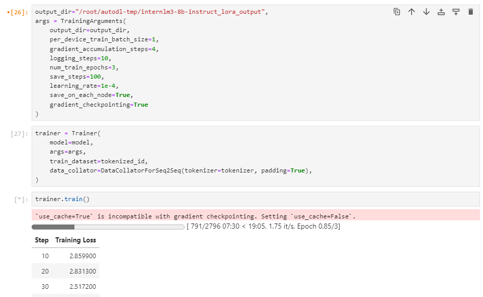

# InternLM3-8b-Instruct LoRA 微调

本节我们简要介绍如何基于 transformers、peft 等框架，使用由笔者合作开源的 [Chat-甄嬛](https://github.com/KMnO4-zx/huanhuan-chat) 项目中的**嬛嬛数据集**作为微调数据集，对 InternLM3-8b-Instruct 模型进行 LoRA 微调, 以构建一个能够模拟甄嬛对话风格的个性化 LLM , 数据集路径为[`../../dataset/huanhuan.json`](../../dataset/huanhuan.json)。

> **LoRA** 是一种高效微调方法，深入了解其原理可参见博客：[知乎|深入浅出 LoRA](https://zhuanlan.zhihu.com/p/650197598)。

> 本教程会在同目录下给大家提供一个 [**notebook** 文件 (04-InternLM3-8B-Instruct LoRA.ipynb)](04-InternLM3-8B-Instruct%20LoRA.ipynb) ，来帮助大家更好的学习。

## 环境配置

实验所依赖的基础开发环境如下：

```
----------------
ubuntu 22.04
Python 3.12.3
cuda 12.1
pytorch 2.3.0
----------------
```
> 本文默认学习者已安装好以上 Pytorch(cuda) 环境，如未安装请自行安装。

首先 `pip` 换源加速下载并安装依赖包：

```shell
# 升级pip
python -m pip install --upgrade pip
# 更换 pypi 源加速库的安装
pip config set global.index-url https://pypi.tuna.tsinghua.edu.cn/simple

pip install modelscope==1.22.0    # 用于模型下载和管理
pip install transformers==4.47.1  # Hugging Face 的模型库，用于加载和训练模型
pip install streamlit==1.41.1
pip install sentencepiece==0.2.0
pip install accelerate==0.34.2    # 用于分布式训练和混合精度训练
pip install datasets==2.20.0      # 用于加载和处理数据集
pip install peft==0.11.1          # 用于 LoRA 微调
```

> 考虑到部分同学配置环境可能会遇到一些问题，我们在 AutoDL 平台准备了 InternLM3-8b-Instruct 的环境镜像，点击下方链接并直接创建 AutoDL 示例即可。
> ***https://www.codewithgpu.com/i/datawhalechina/self-llm/InternLM3-self-llm***

## 模型下载

`modelscope` 是一个模型管理和下载工具，支持从魔搭 (Modelscope) 等平台快速下载模型。

这里使用 `modelscope` 中的 `snapshot_download` 函数下载模型，第一个参数 `model_name_or_path` 为模型名称或者本地路径，第二个参数 `cache_dir` 为模型的下载路径，第三个参数 `revision` 为模型的版本号。

在 `/root/autodl-tmp` 路径下新建 `model_download.py` 文件并在其中粘贴以下代码，并保存文件。

```python
from modelscope import snapshot_download

model_dir = snapshot_download('Shanghai_AI_Laboratory/internlm3-8b-instruct', cache_dir='./', revision='master')
```

> 注意：记得修改 cache_dir 为你的模型下载路径哦~

在终端运行 `python /root/autodl-tmp/model_download.py` 执行下载，模型大小为 18GB 左右，下载模型大概需要5-30分钟。


## 指令集构建

LLM 的微调一般指指令微调过程。所谓指令微调，是说我们使用的微调数据形如：

```json
{
  "instruction": "回答以下用户问题，仅输出答案。",
  "input": "1+1等于几?",
  "output": "2"
}
```

其中，`instruction` 是用户指令，告知模型其需要完成的任务；`input` 是用户输入，是完成用户指令所必须的输入内容；`output` 是模型应该给出的输出。

即我们的核心训练目标是让模型具有理解并遵循用户指令的能力。因此，在指令集构建时，我们应针对我们的目标任务，针对性构建任务指令集。

例如，在本节我们使用由笔者合作开源的 [**Chat-甄嬛**](https://github.com/KMnO4-zx/huanhuan-chat) 项目作为示例，我们的目标是构建一个能够模拟甄嬛对话风格的个性化 LLM，因此我们构造的指令形如：

```json
{
  "instruction": "你是谁？",
  "input": "",
  "output": "家父是大理寺少卿甄远道。"
}
```

我们所构造的全部指令数据集会被保存在根目录下。

## 数据格式化

`LoRA` 训练的数据是需要经过格式化、编码之后再输入给模型进行训练的，如果是熟悉 `Pytorch` 模型训练流程的同学会知道，我们一般需要将输入文本编码为 `input_ids`，将输出文本编码为 `labels`，编码之后的结果都是多维的向量。

为了得到 InternLM3-8b-Instruct 的 Prompt Template，使用 tokenizer 构建 messages 并打印， 查看 chat_template 的输出格式

```python
messages = [
            {"role": "system", "content": "You are a helpful assistant."},
            {"role": "user", "content": '你好呀'},
            {"role": "assistant", "content": '有什么可以帮你的？'}
            ]
# 使用chat_template将messages格式化并打印
print(tokenizer.apply_chat_template(messages, tokenize=False, add_generation_prompt=True))


## 得到输出结果如下

# <s><|im_start|>system
# You are a helpful assistant.<|im_end|>
# <|im_start|>user
# 你好呀<|im_end|>
# <|im_start|>assistant
# 有什么可以帮你的？<|im_end|>
# <|im_start|>assistant
```

然后我们就可以定义预处理函数 `process_func`，这个函数用于对每一个样本，编码其输入、输出文本并返回一个编码后的字典，方便模型使用：

```python
system_prompt = '现在你要扮演皇帝身边的女人--甄嬛'

def process_func(example):
    MAX_LENGTH = 384    # Llama分词器会将一个中文字切分为多个token，因此需要放开一些最大长度，保证数据的完整性
    input_ids, attention_mask, labels = [], [], []
    # 构建指令部分的输入
    instruction = tokenizer(
        f"<s><|im_start|>system\n{system_prompt}<|im_end|>\n" 
        f"<|im_start|>user\n{example['instruction'] + example['input']}<|im_end|>\n"  
        f"<|im_start|>assistant\n",  
        add_special_tokens=False   
    )
    # 构建模型回复部分的输入
    response = tokenizer(
        f"{example['output']}",
        add_special_tokens=False 
    )
    # 拼接指令和回复部分的 input_ids
    input_ids = instruction["input_ids"] + response["input_ids"] + [tokenizer.pad_token_id]
    # 拼接指令和回复部分的 attention_mask
    attention_mask = instruction["attention_mask"] + response["attention_mask"] + [1]  # 因为 EOS token 也需要关注，所以补充为 1
    # 构建标签
    # 对于指令部分，使用 -100 忽略其损失计算；对于回复部分，保留其 input_ids 作为标签
    labels = [-100] * len(instruction["input_ids"]) + response["input_ids"] + [tokenizer.pad_token_id]  
    # 如果总长度超过最大长度，进行截断
    if len(input_ids) > MAX_LENGTH: 
        input_ids = input_ids[:MAX_LENGTH]
        attention_mask = attention_mask[:MAX_LENGTH]
        labels = labels[:MAX_LENGTH]
    return {
        "input_ids": input_ids,
        "attention_mask": attention_mask,
        "labels": labels
    }
```

> 补充: `InternLM3-8b-Instruct` 采用的 `Prompt Template`格式如下：

```text
<s><|im_start|>system
You are a helpful assistant.<|im_end|>
<|im_start|>user
你是谁？<|im_end|>
<|im_start|>assistant
我是一个有用的助手。<|im_end|>
```

## 加载 tokenizer 和半精度模型 (model)

`tokenizer` 是将文本转换为模型 (`model`) 能理解的数字的工具，`model` 是根据这些数字生成文本的核心部分。

以半精度形式加载 `model`, 如果你的显卡比较新的话，可以用 `torch.bfolat` 形式加载。对于自定义模型，必须指定 `trust_remote_code=True` ，以确保加载自定义代码时不会报错。

```python
model_path = '/root/autodl-tmp/Shanghai_AI_Laboratory/internlm3-8b-instruct'

tokenizer = AutoTokenizer.from_pretrained(model_path, use_fast=False, trust_remote_code=True)

# 在internlm3-8b-instruct/tokenizer_config.json中, 128131 是 '<|im_end|>' token值
tokenizer.pad_token_id = tokenizer.eos_token_id = 128131  

model = AutoModelForCausalLM.from_pretrained(model_path, device_map="auto",
                                             torch_dtype=torch.bfloat16, 
                                             trust_remote_code=True)
```

> 注意：此处要记得修改为自己的模型路径哦~

如果想要查看模型结构，可以打印模型：

```python
print(model)

# 输出结果如下

# InternLM3ForCausalLM(
#   (model): InternLM3Model(
#     (embed_tokens): Embedding(128512, 4096, padding_idx=2)
#     (layers): ModuleList(
#       (0-47): 48 x InternLM3DecoderLayer(
#         (self_attn): InternLM3SdpaAttention(
#           (q_proj): Linear(in_features=4096, out_features=4096, bias=False)
#           (k_proj): Linear(in_features=4096, out_features=256, bias=False)
#           (v_proj): Linear(in_features=4096, out_features=256, bias=False)
#           (o_proj): Linear(in_features=4096, out_features=4096, bias=False)
#           (rotary_emb): InternLM3RotaryEmbedding()
#         )
#         (mlp): InternLM3MLP(
#           (gate_proj): Linear(in_features=4096, out_features=10240, bias=False)
#           (up_proj): Linear(in_features=4096, out_features=10240, bias=False)
#           (down_proj): Linear(in_features=10240, out_features=4096, bias=False)
#           (act_fn): SiLU()
#         )
#         (input_layernorm): InternLM3RMSNorm((4096,), eps=1e-05)
#         (post_attention_layernorm): InternLM3RMSNorm((4096,), eps=1e-05)
#       )
#     )
#     (norm): InternLM3RMSNorm((4096,), eps=1e-05)
#     (rotary_emb): InternLM3RotaryEmbedding()
#   )
#   (lm_head): Linear(in_features=4096, out_features=128512, bias=False)
# )
```

上面打印了 `InternLM3Model` 的模型结构， 可以看到里面的 `self_attn` 和 `mlp` 是两个主要的模块， 因此可以考虑将这两个模块作为 **LoRA** 微调 的  `target_modules` , 包括 `q_proj`, `k_proj`, `v_proj`, `o_proj` 以及 `gate_proj`、`up_proj` 和 `down_proj` 。

通常我们只对 `self_attn` 模块中的 `q_proj`, `k_proj`, `v_proj`, `o_proj`进行微调， 本教程里我们也将对这四个模块进行微调演示， 感兴趣的同学可以自行尝试添加对 `mlp` 中的三个 `proj` 模块进行微调。

## 定义 LoraConfig

`LoraConfig`类用于设置 LoRA 微调参数，虽然可以设置很多参数，但主要的参数没多少，简单讲一讲，感兴趣的同学可以直接看源码。

- `task_type`：模型类型
- `target_modules`：需要训练的模型层的名字，主要就是 `attention`部分的层，不同的模型对应的层的名字不同，可以传入数组，也可以字符串，也可以正则表达式。
- `r`：`LoRA`的秩，具体可以看 `LoRA`原理。
- `lora_alpha`：`LoRA alaph` ，具体作用参见 `LoRA` 原理。
- `lora_dropout`: `LoRA` 层的 `Dropout` 比例，用于防止过拟合，具体作用参见 `LoRA` 原理。 

`LoRA`的缩放是啥嘞？当然不是 `r`（秩），这个缩放就是 `lora_alpha/r`, 在这个 `LoraConfig`中缩放就是 4 倍。

```python
from peft import LoraConfig, TaskType, get_peft_model

config = LoraConfig(
    task_type=TaskType.CAUSAL_LM, 
    target_modules=["q_proj", "k_proj","v_proj", "o_proj"], # 可以自行添加更多微调的target_modules
    inference_mode=False,     # 训练模式
    r=8,                      # LoRA 秩
    lora_alpha=32,            # LoRA alaph，具体作用参见 LoRA 原理
    lora_dropout=0.1          # Dropout 比例
)
```

## 自定义 TrainingArguments 参数

`TrainingArguments`类用于设置微调训练过程中的配置参数，这个类的源码也介绍了每个参数的具体作用，当然大家可以来自行探索，这里就简单说几个常用的。

- `output_dir`：模型的输出路径
- `per_device_train_batch_size`：顾名思义 `batch_size`，批量大小
- `gradient_accumulation_steps`: 梯度累加，如果你的显存比较小，那可以把 `batch_size` 设置小一点，梯度累加增大一些。
- `logging_steps`：多少步，输出一次 `log`
- `num_train_epochs`：顾名思义 `epoch`，训练轮次
- `gradient_checkpointing`：梯度检查，这个一旦开启，模型就必须执行 `model.enable_input_require_grads()`，这个原理大家可以自行探索，这里就不细说了。

```python
args = TrainingArguments(
    output_dir="/root/autodl-tmp/internlm3-8b-instruct_lora_output",
    per_device_train_batch_size=1,
    gradient_accumulation_steps=4,
    logging_steps=10,
    num_train_epochs=3,
    save_steps=100, 
    learning_rate=1e-4,
    save_on_each_node=True,
    gradient_checkpointing=True
)
```

## 使用 Trainer 训练

我们使用 `Trainer` 类来管理训练过程。`TrainingArguments` 用于设置训练参数，`Trainer` 则负责实际的训练逻辑。

```python
trainer = Trainer(
    model=model,                 # 要训练的模型
    args=args,                   # 训练参数
    train_dataset=tokenized_id,  # 训练数据集
    data_collator=DataCollatorForSeq2Seq(tokenizer=tokenizer, padding=True),  # 数据整理器
)
trainer.train()                  # 开始训练
```


> 如上配置中, 训练时间大概为 30-40 分钟, 其中 3729 组数据, 训练轮次为 3 轮, 每 4 步梯度累加更新一次(`real batch size=1*4=4`), 每 100 步保存一次 checkpoint, 总共大约 2800 步 (3729/4*3 ~= 2796)

## 加载 LoRA 权重推理

训练好了之后可以使用如下方式加载 `LoRA`权重进行推理：

```python
from transformers import AutoModelForCausalLM, AutoTokenizer
import torch
from peft import PeftModel

model_path = '/root/autodl-tmp/Shanghai_AI_Laboratory/internlm3-8b-instruct'
lora_path = '/root/autodl-tmp/internlm3-8b-instruct_lora_output/checkpoint-2796' # 这里改成 LoRA 输出对应 checkpoint 地址和最终的 epoch 数值 2796

# 加载tokenizer
tokenizer = AutoTokenizer.from_pretrained(model_path, trust_remote_code=True)

# 加载模型
model = AutoModelForCausalLM.from_pretrained(model_path, 
                                             device_map="auto",
                                             torch_dtype=torch.bfloat16, 
                                             trust_remote_code=True).eval()

# 加载lora权重
model = PeftModel.from_pretrained(model, model_id=lora_path)

prompt = "你是谁？"
system_prompt = "现在你要扮演皇帝身边的女人--甄嬛"
print("prompt: ", prompt)
print("system_prompt: ", system_prompt)

inputs = tokenizer.apply_chat_template([{"role": "system", "content": system_prompt},
                                        {"role": "user", "content": prompt}],
                                       add_generation_prompt=True,
                                       tokenize=True,
                                       return_tensors="pt",
                                       return_dict=True
                                       ).to(model.device)  # 将 inputs 移动到模型所在的设备，确保设备一致性


gen_kwargs = {"max_length": 2500, "do_sample": True, "top_k": 1}
with torch.no_grad():
    outputs = model.generate(**inputs, **gen_kwargs)
    outputs = outputs[:, inputs['input_ids'].shape[1]:]
    print("output: ", tokenizer.decode(outputs[0], skip_special_tokens=True))
```


> 注意修改为自己的模型路径哦~‘

> 如果显示 `Some parameters are on the meta device because they were offloaded to the cpu.` 的报错，需要将实例关机，重启后单独运行本条代码。
