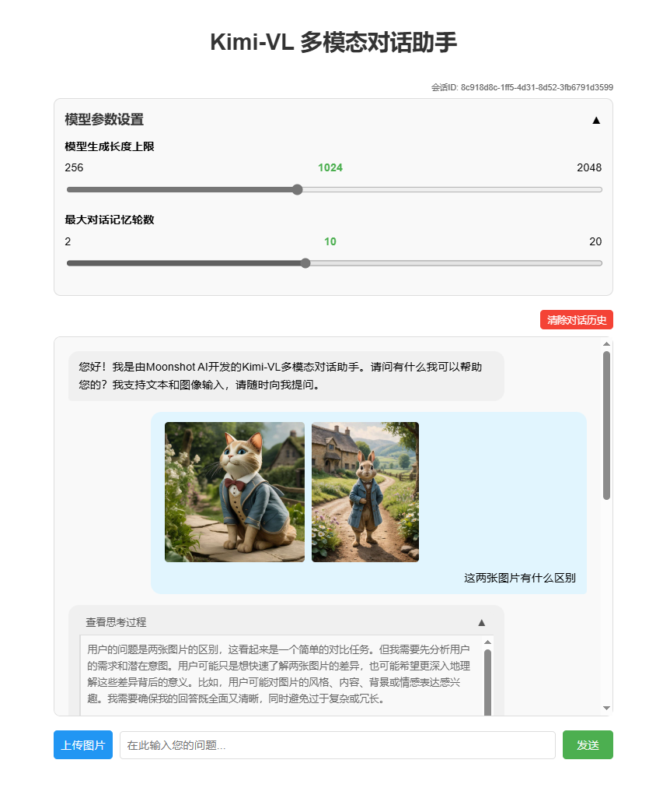
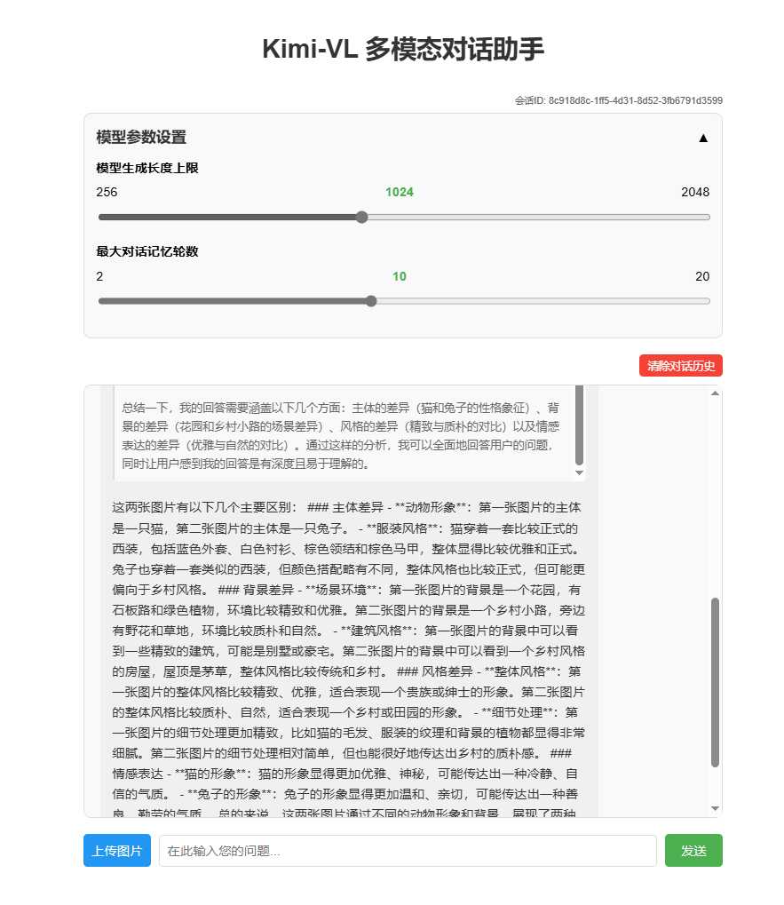

# Kimi-VL-多模态推理对话助手


## 效果展示







## 环境准备  

基础环境：

```
----------------
ubuntu 22.04
python 3.12
cuda 12.4
pytorch 2.6.0
----------------
另外：保证有足够的GPU显存
```
首先 `pip` 换源加速下载并安装依赖包

```shell
pip config set global.index-url https://pypi.tuna.tsinghua.edu.cn/simple

pip install transformers==4.48.2
pip install accelerate==1.6.0
pip install flask==3.1.0
pip install blobfile==3.0.0
pip install pillow==10.4.0
pip install modelscope==1.22.3

```


## 模型下载  

使用 `modelscope` 中的 `snapshot_download` 函数下载模型，第一个参数为模型名称，参数 `cache_dir` 为模型的下载路径。

新建 `model_download.py` 文件输入以下代码，并运行 `python model_download.py` 执行下载。

此处使用 `modelscope` 提供的 `snapshot_download` 函数进行下载，该方法对国内的用户十分友好。

```python
# model_download.py
from modelscope import snapshot_download

model_dir = snapshot_download('moonshotai/Kimi-VL-A3B-Thinking', cache_dir='请修改我！', revision='master')
print(f"模型下载完成，保存路径为：{model_dir}")
```

> 注意：请记得修改 `cache_dir` 为你自己的模型下载路径 ~


## 应用搭建

#### 后端代码

```python
# app.py

from flask import Flask, request, jsonify, render_template, session
import torch
from transformers import AutoTokenizer, AutoModelForCausalLM, AutoProcessor
import gc
import re
import uuid
import json
import base64
import logging
from io import BytesIO
from PIL import Image

# 配置日志
# logging.basicConfig(level=logging.INFO, format='%(asctime)s - %(name)s - %(levelname)s - %(message)s')
# logger = logging.getLogger(__name__)

app = Flask(__name__)
app.secret_key = "kimi-chatbot-secret-key"  # 用于session加密
# 修改为合理的值：最大100MB
app.config['MAX_CONTENT_LENGTH'] = 100 * 1024 * 1024  # 限制上传文件大小
app.config['MAX_CONTENT_PATH'] = None

# 全局变量存储预加载的模型和tokenizer
MODEL_ID = "请修改我！！！"
tokenizer = None
model = None
processor = None
# 用于存储对话历史的字典
chat_histories = {}
# 默认值设置
DEFAULT_MAX_NEW_TOKENS = 1024
DEFAULT_MAX_HISTORY_LENGTH = 10

# 在应用启动前预加载模型
def load_model():
    global tokenizer, model, processor
    print("正在加载模型和tokenizer，请稍候...")
    
    # 加载processor (用于处理图像和文本)
    processor = AutoProcessor.from_pretrained(MODEL_ID, trust_remote_code=True)
    
    # 加载tokenizer
    tokenizer = AutoTokenizer.from_pretrained(MODEL_ID, trust_remote_code=True)
    
    # 加载模型
    model = AutoModelForCausalLM.from_pretrained(
        MODEL_ID,
        device_map="auto",
        torch_dtype=torch.bfloat16,
        trust_remote_code=True
    )
    print("模型加载完成！")

def clean_response(text):
    """清理模型响应中的特殊token"""
    # 先清理常见的结束标记，包括<|im_end|>和[EOS]
    text = re.sub(r'<\|im_end\|>(\s*\[EOS\])?', '', text)
    text = re.sub(r'\[EOS\]', '', text)
    
    # 保留思考标签
    # 如果存在思考标签，只清理标签内外的结束标记，保留标签本身
    thinking_pattern = r'◁think▷([\s\S]*?)◁/think▷'
    if re.search(thinking_pattern, text):
        # 思考部分的内容
        def clean_thinking_content(match):
            thinking_content = match.group(1)
            # 清理思考内容中的特殊标记
            thinking_content = re.sub(r'<[\|/]?eot[\|]?>', '', thinking_content)
            thinking_content = thinking_content.replace('<|eot|>', '')
            # 清理额外的结束标记
            thinking_content = re.sub(r'<\|im_end\|>(\s*\[EOS\])?', '', thinking_content)
            thinking_content = re.sub(r'\[EOS\]', '', thinking_content)
            return f'◁think▷{thinking_content}◁/think▷'
        
        # 先处理思考标签内的内容
        text = re.sub(thinking_pattern, clean_thinking_content, text)
        
        # 再处理剩余文本中的特殊标记
        remaining_text = re.sub(thinking_pattern, '', text)
        cleaned_remaining = re.sub(r'<[\|/]?eot[\|]?>', '', remaining_text)
        cleaned_remaining = cleaned_remaining.replace('<|eot|>', '')
        # 清理额外的结束标记
        cleaned_remaining = re.sub(r'<\|im_end\|>(\s*\[EOS\])?', '', cleaned_remaining)
        cleaned_remaining = re.sub(r'\[EOS\]', '', cleaned_remaining)
        
        # 替换原文中的思考标签后的部分
        text = re.sub(r'◁/think▷[\s\S]*', f'◁/think▷{cleaned_remaining}', text)
        
        return text.strip()
    else:
        # 根据截图中看到的标记，定义可能的标记形式
        patterns = [
            # 直接匹配具体的标记
            '<|eot|>',
            '<|im_end|>',
            '[EOS]'
        ]
        
        # 应用所有模式
        for pattern in patterns:
            text = text.replace(pattern, '')
        
        # 使用正则表达式处理可能的其他token
        text = re.sub(r'<[\|/]?eot[\|]?>', '', text)  # 匹配形如 <eot>, </eot>, <|eot|> 等
        
        return text.strip()

# 从base64字符串转换为PIL图像，并进行压缩处理
def base64_to_image(base64_str):
    if "base64," in base64_str:
        base64_str = base64_str.split("base64,")[1]
    
    try:
        # logger.info(f"开始处理base64图像，大小约 {len(base64_str) // 1024} KB")
        image_bytes = base64.b64decode(base64_str)
        # logger.info(f"解码后的图像大小: {len(image_bytes) // 1024} KB")
        
        image = Image.open(BytesIO(image_bytes))
        
        # 获取原始尺寸
        original_width, original_height = image.size
        # logger.info(f"原始图像尺寸: {original_width}x{original_height}")
        
        # 压缩大图片，如果宽度或高度超过1500像素，则按比例缩小
        max_size = 1500
        if original_width > max_size or original_height > max_size:
            # 按比例缩放
            if original_width > original_height:
                new_width = max_size
                new_height = int(original_height * (max_size / original_width))
            else:
                new_height = max_size
                new_width = int(original_width * (max_size / original_height))
            
            # 缩放图像
            image = image.resize((new_width, new_height), Image.LANCZOS)
            
            # logger.info(f"图像已压缩: {original_width}x{original_height} -> {new_width}x{new_height}")
        
        # 如果是RGBA模式（带透明通道），转换为RGB
        if image.mode == 'RGBA':
            background = Image.new('RGB', image.size, (255, 255, 255))
            background.paste(image, mask=image.split()[3])  # 使用透明通道作为蒙版
            image = background
            # logger.info("RGBA图像已转换为RGB")
        
        return image
    except Exception as e:
        # logger.error(f"图像处理错误: {str(e)}", exc_info=True)
        # 返回错误，但不中断处理，而是返回一个默认图像
        return Image.new('RGB', (100, 100), color=(200, 200, 200))

@app.route('/')
def home():
    # 创建会话ID
    if 'chat_id' not in session:
        session['chat_id'] = str(uuid.uuid4())
    
    # 如果是新会话，初始化聊天历史
    chat_id = session['chat_id']
    if chat_id not in chat_histories:
        chat_histories[chat_id] = []
    
    # 这里会自动加载前端index.html
    return render_template('index.html', chat_id=chat_id)

@app.route('/api/generate', methods=['POST'])
def generate():
    try:
        # 确保模型已加载
        if tokenizer is None or model is None or processor is None:
            return jsonify({"error": "模型正在加载中，请稍后再试"}), 503
        
        # 获取请求数据，支持JSON和表单数据
        chat_id = request.form.get('chat_id') or request.json.get('chat_id', session.get('chat_id', str(uuid.uuid4())))
        user_input = request.form.get('user_input') or request.json.get('user_input', '')
        
        # logger.info(f"收到请求 chat_id: {chat_id}, 请求方法: {request.method}, 内容类型: {request.content_type}")
        # logger.info(f"请求大小: {request.content_length // 1024 if request.content_length else 0} KB")
        
        # 获取前端传递的参数，如果没有则使用默认值
        max_new_tokens = int(request.form.get('max_new_tokens') or request.json.get('max_new_tokens', DEFAULT_MAX_NEW_TOKENS))
        max_history_length = int(request.form.get('max_history_length') or request.json.get('max_history_length', DEFAULT_MAX_HISTORY_LENGTH))
        
        # 参数限制，确保在合理范围内
        max_new_tokens = max(256, min(max_new_tokens, 2048))
        max_history_length = max(2, min(max_history_length, 20))
        
        # 检查是否有消息输入（可以是纯文本或者包含图像）
        has_input = False
        
        # 如果前端通过JSON传递了完整的历史记录（包含图像）
        chat_history_json = request.form.get('chat_history')
        if chat_history_json:
            try:
                received_history = json.loads(chat_history_json)
                # logger.info(f"收到历史记录，消息数量: {len(received_history)}")
                
                # 初始化或使用已有聊天历史
                if chat_id not in chat_histories:
                    chat_histories[chat_id] = []
                
                # 如果收到的历史不为空，且最后一条是用户消息
                if received_history and len(received_history) > 0 and received_history[-1]['role'] == 'user':
                    has_input = True
                    
                    # 获取用户消息内容
                    user_message = received_history[-1]
                    user_message_content = user_message.get('content', [])
                    
                    # 检查content是否是列表类型
                    if not isinstance(user_message_content, list):
                        # 如果不是列表，可能是旧格式的纯文本，直接进入纯文本处理模式
                        # logger.warning("用户消息内容不是列表格式，转为纯文本处理")
                        has_input = False
                    else:
                        # 处理用户消息中的图像
                        images = []
                        processed_content = []
                        has_images = False
                        
                        # logger.info(f"处理用户消息内容，项目数: {len(user_message_content)}")
                        
                        for i, item in enumerate(user_message_content):
                            # logger.info(f"处理消息项 {i}: {item.get('type') if isinstance(item, dict) else '非字典项'}")
                            
                            if isinstance(item, dict) and item.get('type') == 'image' and 'image' in item:
                                has_images = True
                                # 将base64图像转换为PIL图像对象
                                # logger.info(f"开始处理第 {i+1} 张图像")
                                image = base64_to_image(item['image'])
                                images.append(image)
                                processed_content.append({'type': 'image', 'image': f'image_{len(images)-1}'})
                            elif isinstance(item, dict) and item.get('type') == 'text' and 'text' in item:
                                processed_content.append({'type': 'text', 'text': item['text']})
                                # logger.info(f"添加文本内容: {item['text'][:20]}...")
                        
                        # 如果没有图像，使用标准文本处理
                        if not has_images:
                            # logger.warning("未找到图像内容，转为纯文本处理")
                            has_input = False
                        else:
                            # logger.info(f"成功处理 {len(images)} 张图像")
                            # 更新聊天历史中用户消息的图像
                            user_message['content'] = processed_content
                            chat_histories[chat_id].append(user_message)
                            
                            try:
                                # 使用processor处理多模态输入
                                # 构建符合processor要求的消息格式
                                messages = [
                                    {
                                        "role": "user",
                                        "content": processed_content
                                    }
                                ]
                                
                                # 应用聊天模板
                                # logger.info("应用聊天模板...")
                                text = processor.apply_chat_template(messages, add_generation_prompt=True, return_tensors="pt")
                                
                                # 处理输入
                                # logger.info("处理图像输入...")
                                inputs = processor(images=images, text=text, return_tensors="pt", padding=True, truncation=True).to(model.device)
                                
                                # 生成响应
                                # logger.info(f"开始生成响应，max_new_tokens={max_new_tokens}...")
                                with torch.no_grad():
                                    generated_ids = model.generate(**inputs, max_new_tokens=max_new_tokens)
                                    
                                # 处理输出
                                generated_ids_trimmed = [
                                    out_ids[len(in_ids):] for in_ids, out_ids in zip(inputs.input_ids, generated_ids)
                                ]
                                
                                response = processor.batch_decode(
                                    generated_ids_trimmed, skip_special_tokens=True, clean_up_tokenization_spaces=False
                                )[0]
                                
                                # 清理响应，移除结束标记
                                cleaned_response = clean_response(response)
                                # logger.info(f"生成的响应: {cleaned_response[:50]}...")
                                
                                # 添加模型回复到历史记录
                                chat_histories[chat_id].append({"role": "assistant", "content": cleaned_response})
                                
                                # 如果历史记录太长，保留最新的max_history_length条
                                if len(chat_histories[chat_id]) > max_history_length * 2:  # 用户和助手消息各占一半
                                    chat_histories[chat_id] = chat_histories[chat_id][-max_history_length*2:]
                                
                                # 清理缓存
                                torch.cuda.empty_cache()
                                gc.collect()
                                
                                return jsonify({
                                    "response": cleaned_response,
                                    "chat_id": chat_id,
                                    "max_new_tokens": max_new_tokens,
                                    "max_history_length": max_history_length
                                })
                            except Exception as e:
                                # logger.error(f"多模态生成过程中出错: {str(e)}", exc_info=True)
                                return jsonify({"error": f"多模态生成过程中出错: {str(e)}"}), 500
            except Exception as e:
                # logger.error(f"处理多模态输入时出错: {str(e)}", exc_info=True)
                return jsonify({"error": f"处理多模态输入时出错: {str(e)}"}), 500
        
        # 传统文本输入处理（向后兼容）
        if not has_input:
            # logger.info("使用传统文本输入处理")
            
            # 判断是否有文本输入
            if not user_input and not request.form:
                return jsonify({"error": "请输入问题或上传图片"}), 400
            
            # 获取或初始化聊天历史
            if chat_id not in chat_histories:
                chat_histories[chat_id] = []
            
            # 添加用户消息到历史记录
            chat_histories[chat_id].append({"role": "user", "content": user_input})
            
            # 从历史记录构建消息列表，使用前端传递的历史长度
            messages = chat_histories[chat_id][-max_history_length*2:]  # 用户和助手消息各算一条
            
            # 应用chat模板
            inputs = tokenizer.apply_chat_template(messages, add_generation_prompt=True, return_tensors="pt", return_dict=True)
            
            # 生成响应
            with torch.no_grad():
                outputs = model.generate(**inputs.to(model.device), max_new_tokens=max_new_tokens)
            response = tokenizer.batch_decode(outputs[:, inputs["input_ids"].shape[-1]:])
            
            # 清理缓存
            torch.cuda.empty_cache()
            gc.collect()
            
            # 清理响应，移除结束标记
            cleaned_response = clean_response(response[0])
            
            # 添加模型回复到历史记录
            chat_histories[chat_id].append({"role": "assistant", "content": cleaned_response})
            
            # 如果历史记录太长，保留最新的max_history_length条
            if len(chat_histories[chat_id]) > max_history_length * 2:  # 用户和助手消息各占一半
                chat_histories[chat_id] = chat_histories[chat_id][-max_history_length*2:]
            
            return jsonify({
                "response": cleaned_response,
                "chat_id": chat_id,
                "max_new_tokens": max_new_tokens,
                "max_history_length": max_history_length
            })
    
    except Exception as e:
        import traceback
        error_details = traceback.format_exc()
        # logger.error(f"处理请求时发生错误: {str(e)}\n{error_details}")
        return jsonify({"error": str(e)}), 500

@app.route('/api/clear_history', methods=['POST'])
def clear_history():
    try:
        data = request.json
        chat_id = data.get('chat_id', session.get('chat_id'))
        
        if chat_id and chat_id in chat_histories:
            chat_histories[chat_id] = []
            return jsonify({"success": True, "message": "聊天历史已清除"})
        else:
            return jsonify({"success": False, "error": "无效的会话ID"}), 400
    except Exception as e:
        return jsonify({"success": False, "error": str(e)}), 500

if __name__ == '__main__':
    # 在另一个线程中预加载模型
    import threading
    threading.Thread(target=load_model).start()
    
    app.run(debug=True, host='0.0.0.0', port=5000, use_reloader=False) 
```

> 注意：同样记得修改 `MODEL_ID` 为你自己的模型下载路径 ~


## 运行应用

```bash
python app.py
```

应用将在 http://localhost:5000 上运行。

**注意**：启动后模型会在后台自动加载，这可能需要1-2分钟。在此期间，界面会显示"模型正在加载中"的提示，加载完成后才能开始对话。


## 使用方法

1. 在浏览器中打开 http://localhost:5000
2. 等待模型加载完成（顶部的橙色通知条消失）
3. 根据需要调整参数滑动条：
   - **生成长度上限**：控制每次回复生成的最大token数（范围：256-2048）
   - **历史记录长度**：控制对话中保留的最大轮数（范围：2-20）
4. 在输入框中输入您的问题
5. 点击"发送"按钮或按Enter键发送问题
6. 等待模型生成回复
7. 继续进行多轮对话，模型会记住之前的对话内容
8. 如需清除对话历史，点击"清除对话历史"按钮


## 参考代码及其使用

本次教程搭建了一个基于 `Kimi-VL-A3B-Thinking` 的前后端分离的对话助手，额外提供了参考代码供学习者参考
