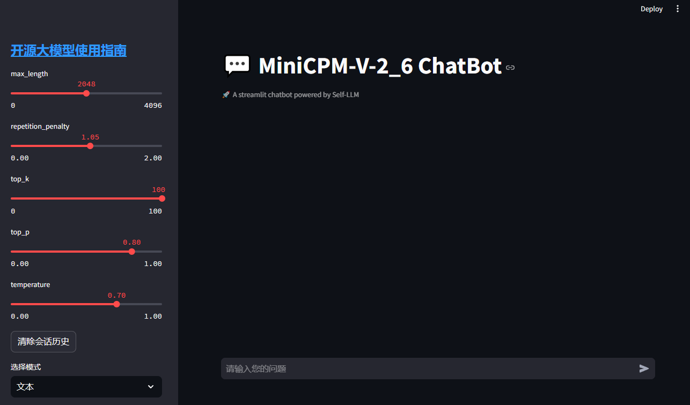
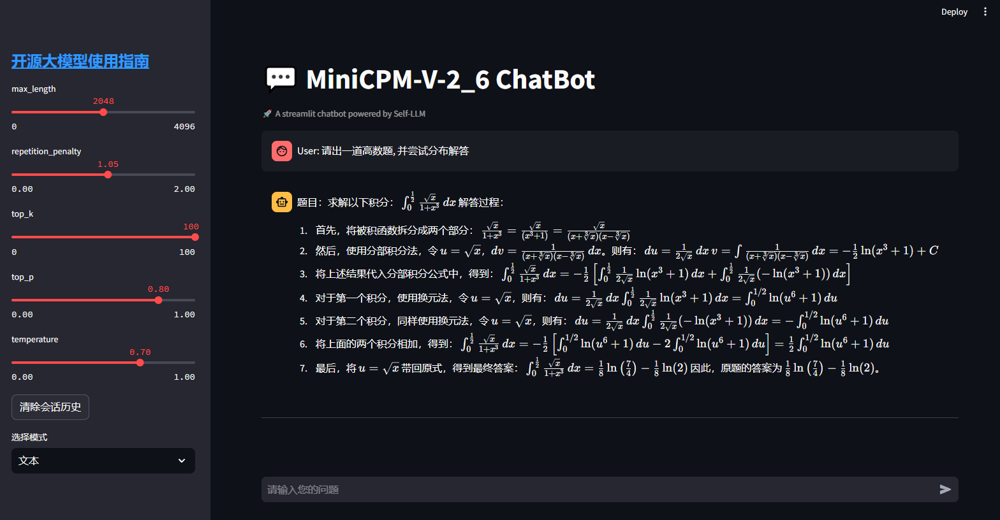
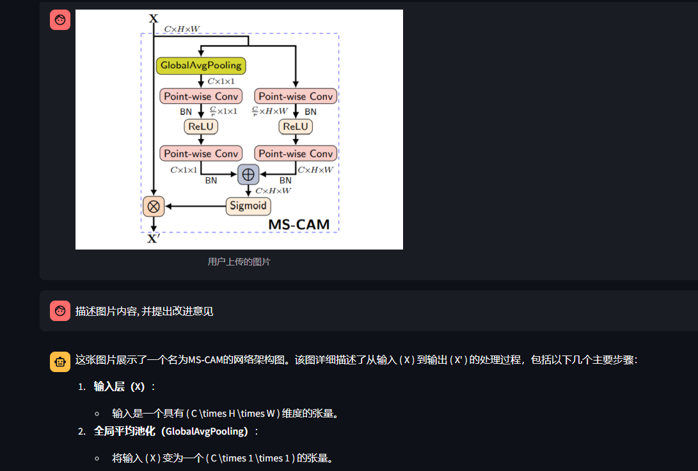
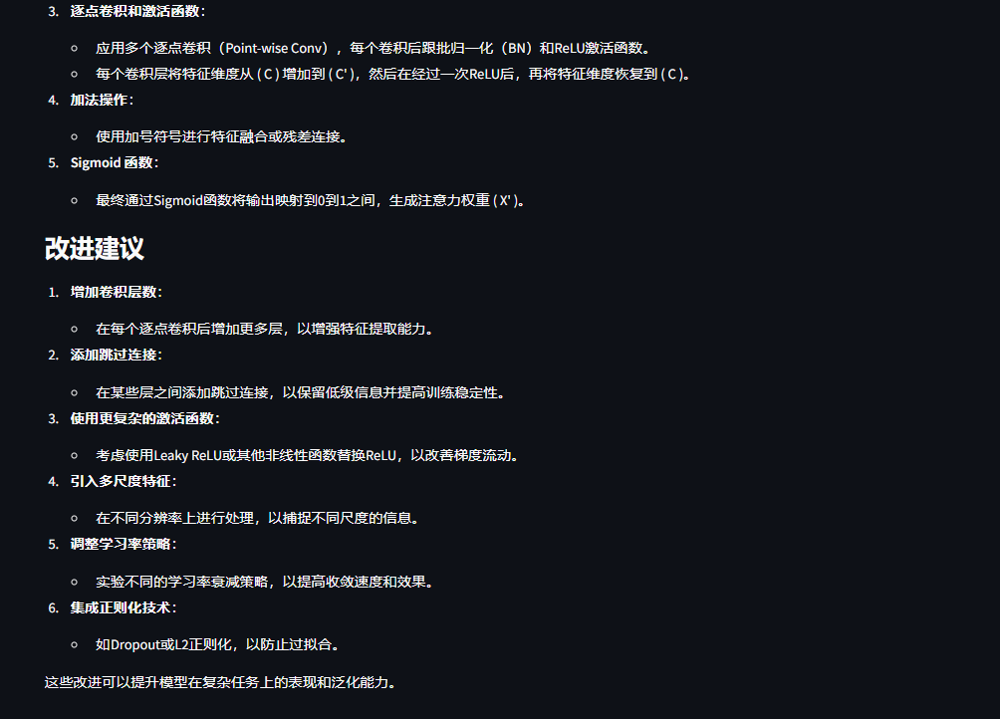
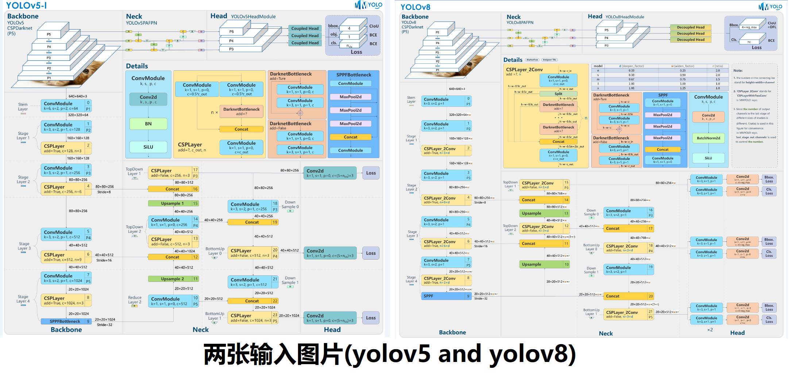
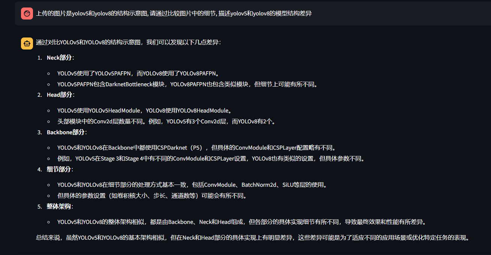
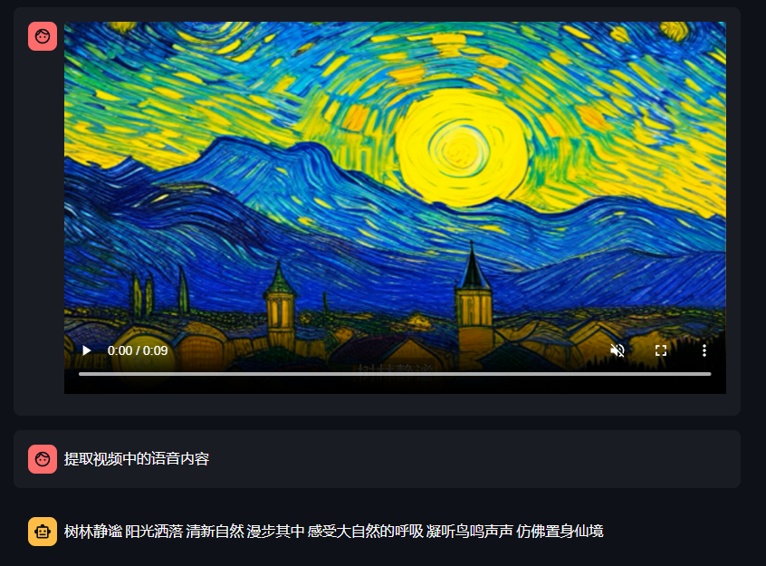
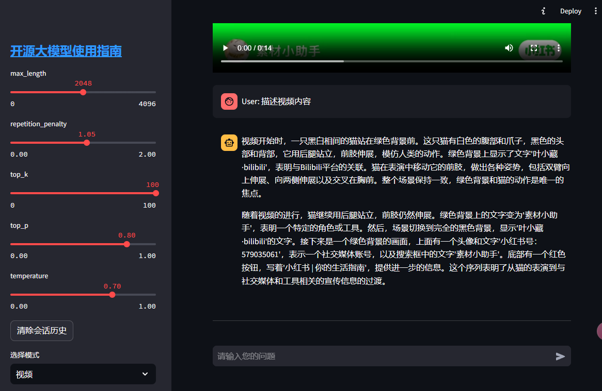

# InternLM3-8B-Instruct WebDemo 部署

## 环境配置

基础环境如下：

```
----------------
ubuntu 22.04
Python 3.12.3
cuda 12.1
pytorch 2.3.0
----------------
```

打开终端或新建 `Jupyter.ipynb` 文件，换源加速及安装魔搭依赖

```shell
pip config set global.index-url https://pypi.tuna.tsinghua.edu.cn/simple

pip install modelscope==1.20.0
```


官方环境打包文件传送门：https://github.com/OpenBMB/MiniCPM-o/blob/main/requirements_o2.6.txt

下载到所属路径下，一键`pip`安装

```shell
pip install -r requirements_o2.6.txt
```


或手动`pip`安装

```shell
pip install Pillow==10.1.0 torch==2.3.1 torchaudio==2.3.1 torchvision==0.18.1 transformers==4.44.2 sentencepiece==0.2.0 vector-quantize-pytorch==1.18.5 vocos==0.1.0 accelerate==1.2.1 timm==0.9.10 soundfile==0.12.1 librosa==0.9.0 decord moviepy fastapi uvicorn python-multipart
```

检查是否有漏装或者报错


## 模型下载

下载 `MiniCPM-o 2.6`模型文件

使用 `modelscope` 中的 `snapshot_download` 函数下载模型，第一个参数为模型名称，参数 `cache_dir` 为模型的下载路径。

```python
from modelscope import snapshot_download
# cache_dir记得修改为自己的目录路径
model_dir = snapshot_download('OpenBMB/MiniCPM-o-2_6', cache_dir='/root/autodl-tmp', revision='master')
```


魔搭社区传送门：[MiniCPM-o-2_6 · 模型库](https://www.modelscope.cn/models/OpenBMB/MiniCPM-o-2_6)


在终端运行 `python /root/autodl-tmp/model_download.py` 执行下载，模型大小为 18GB 左右，下载模型大概需要5-30分钟。

## 代码准备

在本文件下, 提供了[**02minicpm-o-2.6WebDemo_streamlit.py**](02minicpm-o-2.6WebDemo_streamlit.py) 文件，请大家参考, 有比较详细的注释，下面的代码供大家简单了解代码的逻辑结构，可以参考完整代码内容和注释来理解使用和修改，如有不理解的地方欢迎提出 issue 。

```python
# ... 导入必要的库和常量定义 ...

# 加载模型和分词器（使用缓存以提高性能）
@st.cache_resource
def load_model_and_tokenizer():
    print(f"load_model_and_tokenizer from {model_path}")
    model = (AutoModel.from_pretrained(model_path, 
                                       trust_remote_code=True, 
                                       attn_implementation='sdpa').
             to(dtype=torch.bfloat16))
    tokenizer = AutoTokenizer.from_pretrained(model_path, trust_remote_code=True)
    return model, tokenizer

# 初始化模型和会话状态
if 'model' not in st.session_state:
    st.session_state.model, st.session_state.tokenizer = load_model_and_tokenizer()
    st.session_state.model.eval().cuda()

# 初始化聊天历史
if 'chat_history' not in st.session_state:
    # ... 初始化聊天历史和媒体追踪 ...

# 侧边栏配置
with st.sidebar:
    # ... 侧边栏配置项 ...

# 主界面配置
st.title("💬 MiniCPM-V-2_6 聊天机器人")

# 模式选择
selected_mode = st.sidebar.selectbox("选择模式", ["文本", "单图片", "多图片", "视频"])

# 不同模式的处理逻辑
if selected_mode == "单图片":
    # ... 单图片模式处理 ...

elif selected_mode == "多图片":
    # ... 多图片模式处理 ...

elif selected_mode == "视频":
    # ... 视频模式处理 ...

# 聊天输入处理
user_text = st.chat_input("请输入您的问题")
if user_text is not None:
    # 显示用户消息
    with st.chat_message(U_NAME, avatar="user"):
        # ... 显示用户消息 ...

    # 模型响应生成
    with st.chat_message(A_NAME, avatar="assistant"):
        # 根据不同模式处理输入
        if selected_mode == "单图片":
            # ... 单图片处理 ...
        elif selected_mode == "多图片":
            # ... 多图片处理 ...
        elif selected_mode == "视频":
            # ... 视频处理 ...

        # 生成模型响应
        with st.spinner('AI正在思考...'):
            response = model.chat(image=None, msgs=msgs, context=None, tokenizer=tokenizer, **params)
            # ... 处理响应 ...

```

## 运行 demo

在终端中运行以下命令，启动 streamlit 服务，`server.port` 可以更换端口

```bash
streamlit run 02minicpm-o-2.6WebDemo_streamlit.py --server.address 127.0.0.1 --server.port 6006
```

运行成功后可以在terminal中看到如下信息，


在本地浏览器(推荐使用 Chrome 浏览器)中打开链接 http://localhost:6006/ ，即可查看部署的 `WebDemo` 聊天界面。运行效果如下：



左侧为侧边栏，可以设置不同的参数和切换不同的模式(**文本、单图片、多图片、视频**)，右侧为聊天界面，可以输入问题，点击发送后，模型会根据输入的问题和上传的图片或视频，生成回答。

这里简单说下几个可调参数的含义：

- `temperature`：控制生成文本的随机性，值越小，生成文本越稳定，值越大，生成文本越随机。
- `top_p`：控制生成文本的多样性，值越小，生成文本越稳定，值越大，生成文本越随机。
- `top_k`：控制生成文本的多样性，值越小，生成文本越稳定，值越大，生成文本越随机。
- `max_new_tokens`：控制生成文本的最大长度，值越大，生成文本越长。

接下来我将演示下如何使用这个WebDemo，分为**文本、单图片、多图片、视频**四种模式。

### 文本模式

这里采用了自问自答的方式，大家可以自行尝试




### 单图片模式

单图片模式的测试采用了一个 `MS-CAM` 的结构图, 询问了图片内容和改进建议，效果如下





### 多图片模式

这里上传了来自[mmyolo](https://github.com/openmmlab/mmyolo)中的 yolov5 和 yolov8 视觉检测模型的结构图, 同时展示如下



询问两者的异同，测试结果如下



### 视频模式

这里采用的是一个网上的视频, 大家可以测试手头的视频, 建议大家测试的视频不要太大, 否则可能会上传或者解码失败(推荐20秒以内, 10M以内的视频)。




大家也可以尝试下项目里提供的测试视频 [01-11.mp4](images/01-11.mp4)，效果如下

