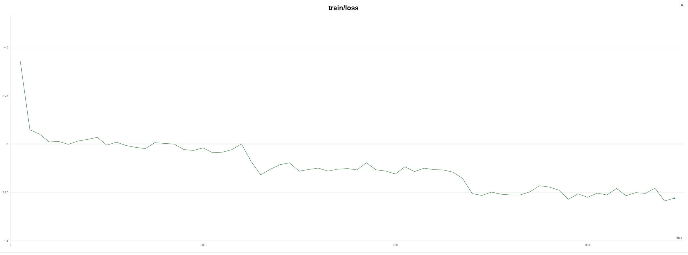

# Qwen3-8B-LoRA及SwanLab可视化记录


## 环境配置

```bash
# 换清华镜像源
pip config set global.index-url https://pypi.tuna.tsinghua.edu.cn/simple

pip install modelscope==1.25.0
pip install transformers==4.51.3
pip install accelerate==1.6.0
pip install datasets==3.5.1
pip install peft==0.15.2
pip install swanlab==0.5.7

```


## 模型下载

```python
# model_download.py 
# 注意修改cache_dir为保存的路径
from modelscope import snapshot_download
model_dir = snapshot_download('Qwen/Qwen3-8B', cache_dir='请修改我！！！', revision='master')

print(f"模型下载完成，保存路径为：{model_dir}")
```


## 数据集构建

对大语言模型进行 `supervised-finetuning`（`sft`，有监督微调）的数据格式如下：

```json
{
  "instruction": "回答以下用户问题，仅输出答案。",
  "input": "1+1等于几?",
  "output": "2"
}
```

其中，`instruction` 是用户指令，告知模型其需要完成的任务；`input` 是用户输入，是完成用户指令所必须的输入内容；`output` 是模型应该给出的输出。

有监督微调的目标是让模型具备理解并遵循用户指令的能力。因此，在构建数据集时，我们应针对我们的目标任务，针对性构建数据。比如，如果我们的目标是通过大量人物的对话数据微调得到一个能够role-play甄嬛对话风格的模型，因此在该场景下的数据示例如下：

```json
{
  "instruction": "你父亲是谁？",
  "input": "",
  "output": "家父是大理寺少卿甄远道。"
}
```

所有的示例微调数据集位于 [/dataset](../dataset/huanhuan.json)


## 数据准备

`LoRA`（`Low-Rank Adaptation`）训练的数据是需要经过格式化、编码之后再输入给模型进行训练的，我们需要先将输入文本编码为 `input_ids`，将输出文本编码为 `labels`，编码之后的结果是向量。我们首先定义一个预处理函数，这个函数用于对每一个样本，同时编码其输入、输出文本并返回一个编码后的字典：

```python
def process_func(example):
    MAX_LENGTH = 1024 # 设置最大序列长度为1024个token
    input_ids, attention_mask, labels = [], [], [] # 初始化返回值
    # 适配chat_template
    instruction = tokenizer(
        f"<s><|im_start|>system\n现在你要扮演皇帝身边的女人--甄嬛<|im_end|>\n" 
        f"<|im_start|>user\n{example['instruction'] + example['input']}<|im_end|>\n"  
        f"<|im_start|>assistant\n<think>\n\n</think>\n\n",  
        add_special_tokens=False   
    )
    response = tokenizer(f"{example['output']}", add_special_tokens=False)
    # 将instructio部分和response部分的input_ids拼接，并在末尾添加eos token作为标记结束的token
    input_ids = instruction["input_ids"] + response["input_ids"] + [tokenizer.pad_token_id]
    # 注意力掩码，表示模型需要关注的位置
    attention_mask = instruction["attention_mask"] + response["attention_mask"] + [1]
    # 对于instruction，使用-100表示这些位置不计算loss（即模型不需要预测这部分）
    labels = [-100] * len(instruction["input_ids"]) + response["input_ids"] + [tokenizer.pad_token_id]  
    if len(input_ids) > MAX_LENGTH:  # 超出最大序列长度截断
        input_ids = input_ids[:MAX_LENGTH]
        attention_mask = attention_mask[:MAX_LENGTH]
        labels = labels[:MAX_LENGTH]
    return {
        "input_ids": input_ids,
        "attention_mask": attention_mask,
        "labels": labels
    }
```

`Qwen3` 采用的 `Chat Template`格式如下：

由于 `Qwen3` 是混合推理模型，因此可以手动选择开启思考模式

不开启 `thinking mode`

```python
messages = [
    {"role": "system", "content": "===system_message_test==="},
    {"role": "user", "content": "===user_message_test==="},
    {"role": "assistant", "content": "===assistant_message_test==="},
]

text = tokenizer.apply_chat_template(
    messages,
    tokenize=False,
    add_generation_prompt=True,
    enable_thinking=False
)
print(text)
```

```
<|im_start|>system
===system_message_test===<|im_end|>
<|im_start|>user
===user_message_test===<|im_end|>
<|im_start|>assistant
<think>

</think>

===assistant_message_test===<|im_end|>
<|im_start|>assistant
<think>

</think>
```
开启 `thinking mode`
```python
messages = [
    {"role": "system", "content": "===system_message_test==="},
    {"role": "user", "content": "===user_message_test==="},
    {"role": "assistant", "content": "===assistant_message_test==="},
]

text = tokenizer.apply_chat_template(
    messages,
    tokenize=False,
    add_generation_prompt=True,
    enable_thinking=True
)
print(text)
```

```
<|im_start|>system
===system_message_test===<|im_end|>
<|im_start|>user
===user_message_test===<|im_end|>
<|im_start|>assistant
<think>

</think>

===assistant_message_test===<|im_end|>
<|im_start|>assistant
```


## 加载模型和tokenizer

```python
tokenizer = AutoTokenizer.from_pretrained('请修改我！！！/Qwen/Qwen3-8B')

model = AutoModelForCausalLM.from_pretrained('请修改我！！！/Qwen/Qwen3-8B', device_map="auto", torch_dtype=torch.bfloat16)
```


## Lora Config

`LoraConfig`这个类中可以设置很多参数，比较重要的如下

- `task_type`：模型类型，现在绝大部分 `decoder_only` 的模型都是因果语言模型 `CAUSAL_LM`
- `target_modules`：需要训练的模型层的名字，主要就是 `attention`部分的层，不同的模型对应的层的名字不同
- `r`：`LoRA` 的秩，决定了低秩矩阵的维度，较小的 `r` 意味着更少的参数
- `lora_alpha`：缩放参数，与 `r` 一起决定了 `LoRA` 更新的强度。实际缩放比例为`lora_alpha/r`，在当前示例中是 `32 / 8 = 4` 倍
- `lora_dropout`：应用于 `LoRA` 层的 `dropout rate`，用于防止过拟合

```python
config = LoraConfig(
    task_type=TaskType.CAUSAL_LM,
    target_modules=["q_proj", "k_proj", "v_proj", "o_proj", "gate_proj", "up_proj", "down_proj"],
    inference_mode=False, # 训练模式
    r=8, # Lora 秩
    lora_alpha=32, # Lora alpha
    lora_dropout=0.1 # Dropout 比例
)
```


## Training Arguments

- `output_dir`：模型的输出路径
- `per_device_train_batch_size`：每张卡上的 `batch_size`
- `gradient_accumulation_steps`:  梯度累计
- `num_train_epochs`：顾名思义 `epoch`

```python
args = TrainingArguments(
    output_dir="./output/Qwen3_8B_LoRA", # 注意修改
    per_device_train_batch_size=4,
    gradient_accumulation_steps=4,
    logging_steps=10,
    num_train_epochs=3,
    save_steps=100, 
    learning_rate=1e-4,
    save_on_each_node=True,
    gradient_checkpointing=True,
    report_to="none",
)
```


## SwanLab简介


[SwanLab](https://github.com/swanhubx/swanlab) 是一个开源的模型训练记录工具，面向AI研究者，提供了训练可视化、自动日志记录、超参数记录、实验对比、多人协同等功能。在 `SwanLab` 上，研究者能基于直观的可视化图表发现训练问题，对比多个实验找到研究灵感，并通过在线链接的分享与基于组织的多人协同训练，打破团队沟通的壁垒。

**为什么要记录训练**

相较于软件开发，模型训练更像一个实验科学。一个品质优秀的模型背后，往往是成千上万次实验。研究者需要不断尝试、记录、对比，积累经验，才能找到最佳的模型结构、超参数与数据配比。在这之中，如何高效进行记录与对比，对于研究效率的提升至关重要。


## 实例化SwanLabCallback

建议先在 [SwanLab官网](https://swanlab.cn/) 注册账号，然后在训练初始化阶段选择

`(2) Use an existing SwanLab account` 并使用 private API Key 登录

```python
import swanlab
from swanlab.integration.transformers import SwanLabCallback

# 实例化SwanLabCallback
swanlab_callback = SwanLabCallback(
    project="Qwen3-Lora",  # 注意修改
    experiment_name="Qwen3-8B-LoRA-experiment"  # 注意修改
)
```


## 使用 Trainer 训练

```python
trainer = Trainer(
    model=model,
    args=args,
    train_dataset=tokenized_id,
    data_collator=DataCollatorForSeq2Seq(tokenizer=tokenizer, padding=True),
    callbacks=[swanlab_callback] # 传入之前的swanlab_callback
)
trainer.train()
```

```
TrainOutput(global_step=699, training_loss=2.6425710331557988, metrics={'train_runtime': 879.9696, 'train_samples_per_second': 12.713, 'train_steps_per_second': 0.794, 'total_flos': 5.190619083415757e+16, 'train_loss': 2.6425710331557988, 'epoch': 2.990353697749196})
```

训练完成后，打开 `SwanLab` ，可以查看训练过程中记录的参数和可视化的训练loss曲线：




## 加载 lora 权重推理

得到任意 `checkpoints` 之后加载 `lora` 权重进行推理：

```python
from transformers import AutoModelForCausalLM, AutoTokenizer
import torch
from peft import PeftModel
 
mode_path = '请修改我！！！/Qwen/Qwen3-8B'  # 注意修改
lora_path = './output/Qwen3_8B_lora/checkpoint-699' # 注意修改

# 加载tokenizer
tokenizer = AutoTokenizer.from_pretrained(mode_path)

# 加载Qwen3 base model
model = AutoModelForCausalLM.from_pretrained(mode_path, device_map="auto",torch_dtype=torch.bfloat16, trust_remote_code=True)

# 加载lora权重
model = PeftModel.from_pretrained(model, model_id=lora_path)

prompt = "你是谁？"
inputs = tokenizer.apply_chat_template(
                                    [{"role": "user", "content": "假设你是皇帝身边的女人--甄嬛。"},{"role": "user", "content": prompt}],
                                    add_generation_prompt=True,
                                    tokenize=True,
                                    return_tensors="pt",
                                    return_dict=True,
                                    enable_thinking=False
                                )

# 采样参数设置
gen_kwargs = {"max_length": 2500, "do_sample": True, "top_k": 1}
with torch.no_grad():
    outputs = model.generate(**inputs, **gen_kwargs)
    outputs = outputs[:, inputs['input_ids'].shape[1]:]
    print(tokenizer.decode(outputs[0], skip_special_tokens=True))
```

```
我是甄嬛，家父是大理寺少卿甄远道。
```

